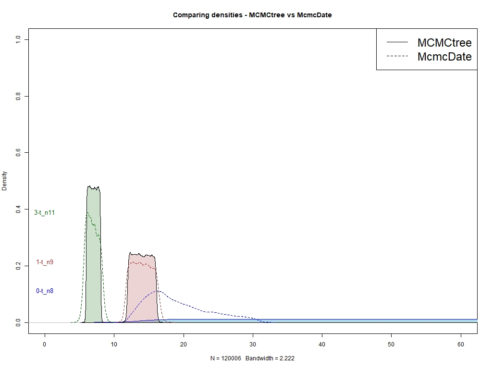
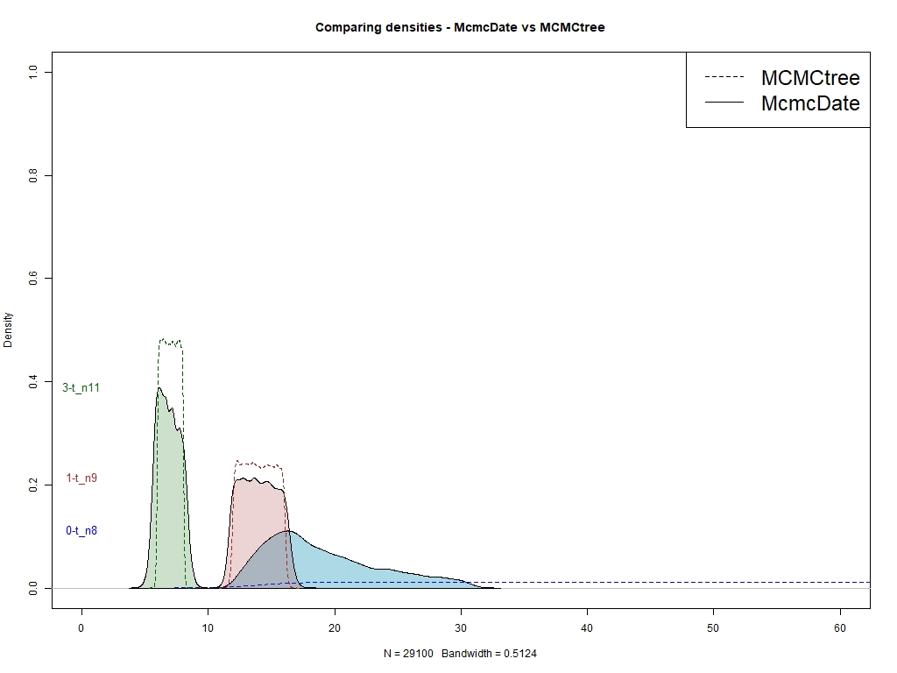
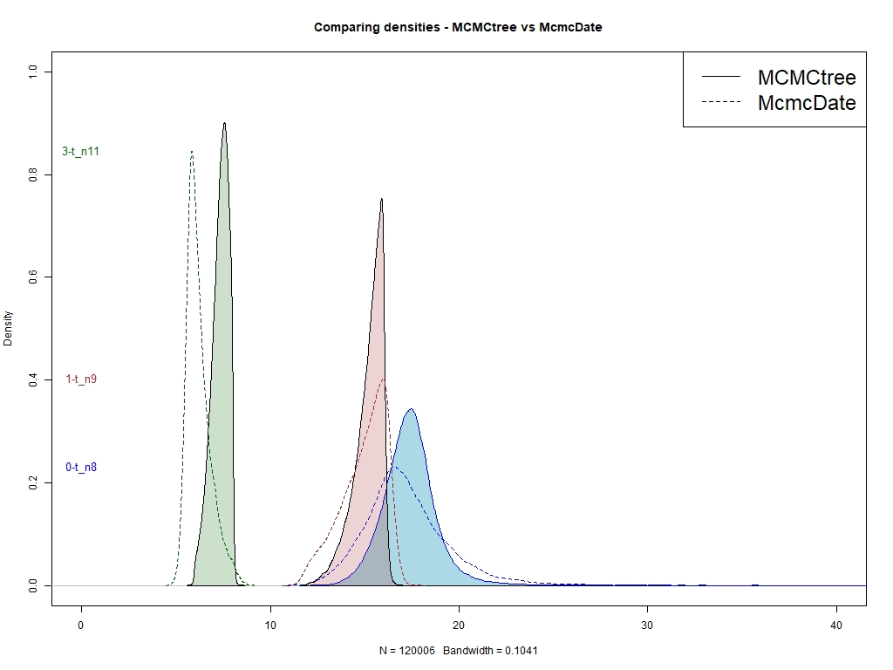
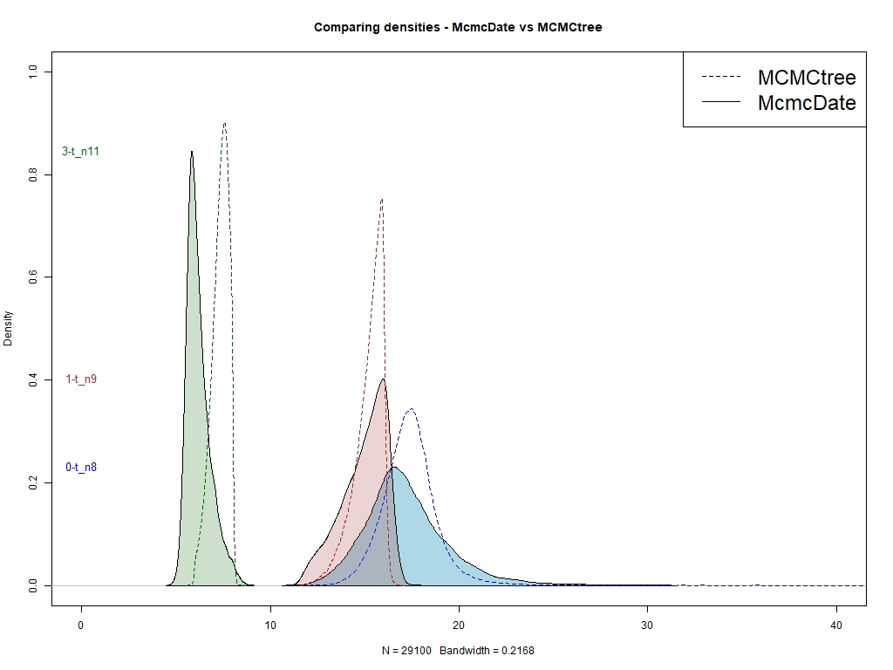
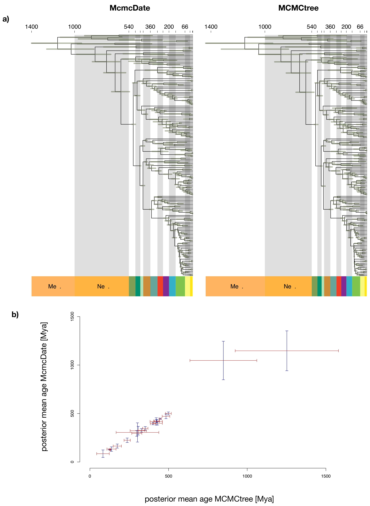

# Benchmarking `McmcDate`

## Citation

If you use the scripts that you will find in this tutorial, please cite the following:

**Álvarez-Carretero., S (2024). sabifo4/Tutorial_MCMCtree: v1.0.0 (tutorialMCMCtree-prerelease). Zenodo. https://doi.org/10.5281/zenodo.11306642**

## Introduction

In order to assess the accuracy with which `McmcDate` estimates divergence times alongside its efficiency, we have decided to benchmark the results inferred with `McmcDate` against those estimated with the well-established dating program `MCMCtree`, part of the [`PAML` package](https://github.com/abacus-gene/paml) ([Yang, 2007](http://abacus.gene.ucl.ac.uk/ziheng/pdf/1997YangCABIOSv13p555.pdf)).

We have decided to use the mitochondrial dataset available from the `PAML` GitHub repository (i.e. [sequence file](https://raw.githubusercontent.com/abacus-gene/paml/master/examples/mtCDNA/mtCDNApri.aa) and [tree file](https://github.com/abacus-gene/paml/blob/master/examples/DatingSoftBound/mtCDNApri.trees)). We have carried out some changes so that the files are adapted to run our benchmarking analyses:

* We changed the calibration notation in [our tree file](01_PAML/mtCDNApri.trees) so that it is clearer which bounds are being used to constrain node ages. We also incorporated the root age in the tree as recommended (i.e., using option `RootAge` in the control file is somewhat discouraged). We have generated one input file for analyses with `MCMCtree` (i.e., [`mtCDNApri.trees`](00_inp_data/mtCDNApri.trees)) and another for those with `McmcDate` (i.e., [`mtCDNApri_MD.trees`](00_inp_data/mtCDNApri_MD.trees)).
* When running `PAML` programs, we will be estimating the branch lengths, the gradient, and the Hessian with `CODEML`, which is what `MCMCtree` will then use to approximate the likelihood calculation ([dos Reis and Yang, 2011](https://academic.oup.com/mbe/article/28/7/2161/1051613)). When running `McmcDate`, we will have a distribution of sampled phylogenies by `PhyloBayes` [Lartillot and Philippe, 2004](http://www.atgc-montpellier.fr/download/papers/cat_2004.pdf), which corresponding branch lengths will be later used by `McmcDate` to calculate the inverse of the covariance matrix to approximate the likelihood calculation during the MCMC.
* We have also included an unrooted tree file without calibrations as one of the input files required by `McmcDate`: [`ur_mtCDNApri.trees`](00_inp_data/mtCDNApri_MD.trees).

Below, you can find the steps we followed to analyse this dataset with both programs as well as the subsequent benchmarking.

----

## Timetree inference analyses

<br>
<details>
<summary><b>How did we run <code>PAML</code> programs for timetree inference?</b></summary>
<br>

### Analyses with `PAML` programs

As aforementioned, you can find the input tree and sequence files that we will be using in [`01_inp_data`](01_PAML/). We used the [available control file](https://github.com/abacus-gene/paml/blob/master/examples/DatingSoftBound/mcmctree.ctl) as a template to create our [own template control file for this analysis](01_PAML/mcmctree_orig.ctl).

You can follow the commands below to run `PAML` programs `CODEML` and `MCMCtree` to enable the approximate likelihood calculation.

#### Running `CODEML`

We will run `CODEML` once as there is only one partition. We will create a copy of the [`mcmctree_orig.ctl` file](01_PAML/mcmctree_orig.ctl) to run this analysis using the code below:

```sh
## Run from `01_PAML`
# Please use your terminal to navigate to 
# this directory, then copy the commands below
# on your terminal
mkdir -p 00_CODEML
cp mcmctree_orig.ctl 00_CODEML/mcmctree_codeml.ctl
# Modify the path to the input sequence file,
# the alignment blocks
sed -i 's/seqfile\ \=\ /seqfile = \.\.\/\.\.\/00\_inp\_data\//' 00_CODEML/mcmctree_codeml.ctl
# Modify the path to the input tree file
sed -i 's/treefile\ \=\ /treefile\ \=\ \.\.\/\.\.\/00\_inp\_data\//' 00_CODEML/mcmctree_codeml.ctl
# Specify `usedata = 3`, which will enable the settings
# for generating the `in.BV` file for approximating
# likelihood calculation
sed -i 's/usedata..*/usedata\ \=\ 3/' 00_CODEML/mcmctree_codeml.ctl
```

Now, we have everything we need to run `CODEML`:

```sh
## Run `CODEML`
# You should still be in this directory 
# but, if not, please change directories until
# you are there. Then, run the following
# commands.
cd 00_CODEML
# Create `tmp001*` files to then run `CODEML`
mcmctree *ctl
```

Note that, when we ran the commands above, we were not interested in running `BASEML` or `MCMCtree` until "the end". We just wanted to execute `MCMCtree` with option `usedata = 3` so that this program generates the `tmp000*` files that `BASEML` will then need as input files to estimate the branch lengths, the gradient, and the Hessian. We carry out this analysis in two steps so that we can replace option `method = 0` with `method = 1` in the `tmp0001.ctl` file that will be output with the commands above. As explained in the [`PAML` documentation](https://github.com/abacus-gene/paml/blob/master/doc/pamlDOC.pdf) (at the time of writing, page 56), the iteration algorithm enabled when setting `method = 1` is much more efficient with large datasets than the algorithm enabled when setting `method = 0`. While this is not a very large dataset, it is good practice to divide these steps into two so that you can always check the `BASEML` settings in the automatically created `tmp0001.ctl` files!

Once we see the `tmp0001.ctl` file generated and the text attached below, we can therefore kill the job by pressing `ctrl+C`!

```text
*** Locus 1 ***
running codeml tmp0001.ctl

AAML in paml version 4.10.7, June 2023
ns = 7          ls = 516
Reading sequences, sequential format..
Reading seq # 7: gibbon
Sequences read..

516 site patterns read, 9993 sites
Counting frequencies..

                Are these a.a. sequences?

      168 bytes for distance
   165120 bytes for conP
    20640 bytes for fhK
  5000000 bytes for space
```

After you have killed the job, you can run the following commands to make sure that the correct settings to run `CODEML` are enabled:

```sh
## Run from `00_CODEML`.
# You should still be in this directory 
# but, if not, please change directories until
# you are there. Then, run the following
# commands.
sed -i 's/method\ \=\ 0/method\ \=\ 1/' tmp0001.ctl
grep 'method = 1' tmp0001.ctl | wc -l # You should get as many as datasets you have
grep 'alpha' tmp0001.ctl   # You should see `fix_alpha = 0` and `alpha = 0.5`
grep 'ncatG' tmp0001.ctl   # You should see `ncatG = 5`
grep 'model' tmp0001.ctl   # You should see `model = 3` (i.e., Empirical+F)
```

Now, we can run `CODEML`!

```sh
## Run from `00_CODEML`.
# You should still be in this directory 
# but, if not, please change directories until
# you are there. Then, run the following
# commands.
mkdir codeml
cp tmp0001* codeml
cd  codeml
rm  tmp0001.out
sed -i 's/lg\.dat/\.\.\/lg\.dat/' tmp0001.ctl
codeml *ctl > log.txt
cd ../
```

The branch lengths, the gradient, and the Hessian are stored in output file `rst2`, which we will rename as `in.BV`:

```sh
## Run from `00_CODEML`
# You should still be in this directory 
# but, if not, please change directories until
# you are there. Then, run the following
# commands.
cp codeml/rst2 in.BV
# Remove unwanted files
rm out* r* tmp* SeedUsed lnf
```

<details>
<summary><b>TIPS FOR ANALYSES WITH PARTITIONED DATASETS</b></summary>
<br>

<i>If you were analysing a partitioned dataset, you would have obtained one `rst2` for each alignment block (i.e., `CODEML` would have been run independently for each alignment block). In such case, you would have needed to concatenate the content of the `rst2` files in a unique file, the so-called `in.BV` file. Note that these `rst2` files should be appended in the same order as they appear in the partitioned sequence file to generate the `in.BV` file (i.e., `rst2` file output when reading the first alignment block will be first, then the `rst2` output file generated for the second alignment block will be second, etc.).</i>

</details>
<br>

Now, we have everything we need to run `MCMCtree`!

#### Running `MCMCtree`

We are going to run `MCMCtree` when sampling from the prior (i.e., no data are used, useful to check whether there are problems between the calibration densities specified by the user and the corresponding marginal densities inferred by the program) and from the posterior (i.e., data are used).

We will run 6 chains when sampling from the prior and 6 chains when sampling from the posterior under the independent-rates log-normal (ILN) relaxed-clock model, which could be compared to the uncorrelated log-normal model implemented in `McmcDate`:

```sh
## Run from `00_CODEML`.
# You should still be in this directory 
# but, if not, please change directories until
# you are there. Then, run the following
# commands.
cd ../
for i in `seq 1 6`
do
# Create file structure for the analyses we will carry out
mkdir -p 01_MCMCtree/{00_prior/CLK,01_posterior/ILN}/$i
printf "[[ Copy files for chain "$i" ]]\n"
# Copy files for prior
cp mcmctree_orig.ctl 01_MCMCtree/00_prior/CLK/$i/mcmctree_$i.ctl
# Modify the path to the input sequence file:
# the name of the partitioned alignment was there,
# but the path has changed. We are using a relative
# path!
sed -i 's/seqfile\ \=\ /seqfile = \.\.\/\.\.\/\.\.\/\.\.\/\.\.\/00\_inp\_data\//' 01_MCMCtree/00_prior/CLK/$i/mcmctree_$i.ctl
# Same as above, but now modify the path to the
# input tree file
sed -i 's/treefile\ \=\ /treefile\ \=\ \.\.\/\.\.\/\.\.\/\.\.\/\.\.\/00\_inp\_data\//' 01_MCMCtree/00_prior/CLK/$i/mcmctree_$i.ctl
# Modify option `usedata` so that `MCMCtree` samples
# from the prior (i.e., no data)
sed -i 's/usedata..*/usedata\ \=\ 0/' 01_MCMCtree/00_prior/CLK/$i/mcmctree_$i.ctl
# Path to the `lg.dat` with the LG matrix
sed -i 's/lg\.dat/\.\.\/lg\.dat/' 01_MCMCtree/00_prior/CLK/$i/mcmctree_$i.ctl
# The analysis will always run faster when no `sigma_2` values are
# sampled, so we specify `clock = 1`. If you specified a
# relaxed-clock model, you would get estimates for the rate
# variation in the `mcmc.txt` file apart from `mu` values
# (one for each alignment block if there is a partitioned
# alignment)
sed -i 's/clock..*/clock\ \=\ 1/' 01_MCMCtree/00_prior/CLK/$i/mcmctree_$i.ctl
# Copy files for posterior (ILN)
cp mcmctree_orig.ctl 01_MCMCtree/01_posterior/ILN/$i/mcmctree_$i.ctl
# Same as above: modify the path to where the input sequence
# file is
sed -i 's/seqfile\ \=\ /seqfile = \.\.\/\.\.\/\.\.\/\.\.\/\.\.\/00\_inp\_data\//' 01_MCMCtree/01_posterior/ILN/$i/mcmctree_$i.ctl
# Same as above: modify the path to where the input tree
# file is
sed -i 's/treefile\ \=\ /treefile\ \=\ \.\.\/\.\.\/\.\.\/\.\.\/\.\.\/00\_inp\_data\//' 01_MCMCtree/01_posterior/ILN/$i/mcmctree_$i.ctl
# Specify `usedata = 2` and the path to the `in.BV` that
# we have just generated, which has the branch lengths,
# gradient, and Hessian estimated by `BASEML` that 
# `MCMCtree` will use to approximate the likelihood
# calculation during the MCMC
sed -i 's/usedata..*/usedata\ \=\ 2 \.\.\/\.\.\/\.\.\/\.\.\/00\_CODEML\/in\.BV/' 01_MCMCtree/01_posterior/ILN/$i/mcmctree_$i.ctl
# Same as above: copy LG matrix
sed -i 's/lg\.dat/\.\.\/lg\.dat/' 01_MCMCtree/01_posterior/ILN/$i/mcmctree_$i.ctl
done
```

Now, we can run `MCMCtree`! You can either run it on your PC or decide whether you want to prepare a job array to run these analyses on an HPC cluster:

```sh
## Run from `01_PAML`
# You should still be in this directory 
# but, if not, please change directories until
# you are there. Then, run the following
# commands.
cd 01_MCMCtree
home_dir=$( pwd )
for i in `seq 1 6`
do
cd $home_dir/00_prior/CLK/$i
printf "[[ Running MCMCtree for chain "$i" | prior ]]\n"
# Run `MCMCtree` while you see the screen output but
# you also save it in a file called `log_mcmc$i"_prior.txt"`
# You will run this analysis when sampling from the prior,
# the posterior under GBM, and the posterior under ILN
mcmctree *ctl 2>&1 | tee log_mcmc$i"_prior.txt"
printf "[[ Running MCMCtree for chain "$i" | posterior (ILN) ]]\n"
cd $home_dir/01_posterior/ILN/$i
mcmctree *ctl 2>&1 | tee log_mcmc$i"_postILN.txt"
done
cd $home_dir
# We can now create a file that will be handy for subsequent
# steps: node numbers as given by `MCMCtree` 
# Only one tree is enough as we have the same tree topology!
grep 'Species tree for FigTree' -A1 00_prior/CLK/1/out.txt | sed -n '2,2p' > 00_prior/node_tree.tree
```

> **IMPORTANT**: when analysing your own datasets, you should always first run `MCMCtree` when sampling from the prior, proceed to [carry out MCMC diagnostics as explained below](./README.md#prior), and make sure that there are no problems between the calibration densities you specified and the marginal densities `MCMCtree` inferred. If you observed serious discrepancies, you would need to go back to your calibrations and check whether you made a mistake or you need to adjust them until the marginal densities really represent your belief about the fossil record. Then, once everything looks alright, you can run `MCMCtree` when sampling from the posterior, and then [run the corresponding MCMC diagnostics as explained below](./README.md#posterior). Nevertheless, we are running `MCMCtree` both when sampling from the prior and the posterior so that we can have the output files ready for both MCMC diagnostics quicker. In other words, timetree inference workflow should look like `prior --> checks --> prior again if checks failed --> check again --> posterior if everything is fine`.

#### MCMC diagnostics

##### Prior

Now that we have the output files from the different MCMC runs in an organised file structure, we are ready to run MCMC diagnostics!

<details>
<summary><b>How did we generate the calibration files that are subsequently used?</b></summary>
<br>

<i>We ran [the in-house R script](01_PAML/scripts/Include_calibrations_MCMCtree.R), which uses file [`calibrations.txt`](00_inp_data/calibs/raw_calibs/calibrations.txt) to generate the rest of the intermediate output files that you shall see inside [`raw_calibs`](00_inp_data/calibs/raw_calibs/) and [`tree_display`](00_inp_data/tree_display/).

If you are here, you should have already run `MCMCtree` and generated output file [`node_tree.tree`](01_PAML/01_MCMCtree/00_prior/node_tree.tree). If that's the case, then you can run the second [in-house R script `Merge_node_labels.R`](01_PAML/scripts/Merge_node_labels.R), which will output the [`Calibnodes_mtcdnapri.csv` file](00_inp_data/calibs/inp_calibs/Calibnodes_mtcdnapri.csv) that you will need to run some scripts throughout the MCMC diagnostics and benchmarking!</i>

</details>
<br>

We are going to run the R script [`MCMC_diagnostics_prior.R`](01_PAML/scripts/MCMC_diagnostics_prior.R) and follow the detailed step-by-step instructions detailed in the script. In a nutshell, the protocol will be the following:

1. Load the `mcmc.txt` files generated after each run.
2. Generate a convergence plot with the unfiltered chains.
3. Find whether there are major differences between the time estimates sampled across the chains for the same node sin the 97.5% and the 2.5% quantiles. If so, flag and delete said chains.
4. If some chains have not passed the filters mentioned above, create an object with the chains that have passed the filters.
5. Generate a new convergence plot with those chains that passed the filters.
6. Calculate Rhat, tail-ESS, and bulk-ESS to check whether chain convergence has been reached with the chains that have passed filters.

The MCMC diagnostics did not find any of the chains problematic after running [our in-house R script `MCMC_diagnostics_prior.R`](01_PAML/scripts/MCMC_diagnostics_prior.R). Therefore, we used [our in-house bash script `Combine_MCMC.sh`](01_PAML/scripts/Combine_MCMC.sh) to concatenate all the `mcmc.txt` files for the 6 chains in a unique file.

```sh
## Run from `01_MCMCtree`
# You should still be in this directory 
# but, if not, please change directories until
# you are there. Then, run the following
# commands.
cd ../scripts
cp Combine_MCMC.sh ../01_MCMCtree/00_prior
# One argument taken: number of chains
cd ../01_MCMCtree/00_prior
## Variables needed
## arg1 --> path to directory where analyses have taken place (e.g., CLK, GBM, ILN)
## arg2 --> output dir: mcmc_files_CLK, mcmc_files_GBM, mcmc_files_ILN, etc.
## arg3 --> "`seq 1 36`", "1 2 5", etc. | depends on whether some chains were filtered out or not
## arg4 --> clock model used: ILN, GBM, CLK
## arg5 --> number of samples specified to collect in the control file to run `MCMCtree`
## arg6 --> 'Y' to generate a directory with files compatible with programs such as `Tracer` to visually
##          inspect traceplots, convergence plots, etc. 'N' otherwise
## arg7 --> if arg6 is 'Y', arg7 needs to have a name for the `mcmcf4traces_<name>` that will be
##          generated. If `arg6` is equal to 'N', then please write `N` too.
path_to_data=$( echo CLK )
num_dat=1
name_dat=( 'mtcdnapri' ) # if you had more dataset, you would add them here!
count=-1 #  counter will start at 0 in first iteration!
for i in `seq 1 $num_dat`
do
count=$(( count + 1 ))
# Run the in-house script to generate concatenated
# `mcmc.txt` file and the individual `mcmc.txt` files
# ready to visually inspect in e.g., Tracer
./Combine_MCMC.sh $path_to_data mcmc_files_${name_dat[count]}_CLK "`seq 1 6`" GBM 20000 Y ${name_dat[count]}_CLK
done
```

The script above will generate a directory called `mcmc_files_<name_dataset>_CLK` inside the `00_prior` directory, where the `mcmc.txt` with the concatenated samples will be saved. In addition, a directory called `mcmcf4traces_<namedataset>_CLK` will also be generated so that formatted MCMC files compatible with programs such as `Tracer` can be used to check for chain convergence. A template script to generate the `FigTree.tre` file with this `mcmc.txt` has been saved inside the [`dummy_ctl_files`](01_PAML/dummy_ctl_files) directory.

We will now create a dummy alignment with only 2 nucleotides to quickly run `MCMCtree` with option `print = -1`. This setting will basically (i) ignore all the settings regarding the evolutionary model and the MCMC, (ii) read the `mcmc.txt` file which path is set in option `mcmcfile`, (iii) and summarise all the samples in such file to generate a timetree. To create the dummy alignment, we will run the [in-house R script `Generate_dummy_aln.R`](01_PAML/scripts/Generate_dummy_aln.R). Once you run it, a new directory called `dummy_aln` will be created, which will contain the dummy alignment. Then, we are ready to run `MCMCtree` with option `print = -1`! Note that the `mcmc.txt` file will have all the samples collected by the chains that passed previous filters during MCMC diagnostics.

```sh
## Run from `00_prior`
# You should still be in this directory 
# but, if not, please change directories until
# you are there. Then, run the following
# commands.
name_dat=( 'mtcdnapri' ) # you would list more datasets here
num_dat=1
count=-1
for i in `seq 1 $num_dat`
do
printf "\n[[ ANALYSING DATASET "${name_dat[count]}" ]]\n\n"
count=$(( count + 1 ))
base_dir=$( pwd )
cd ../../dummy_ctl_files
# Get path to directory where the ctl file is
ctl_dir=$( pwd )
cd ../../00_inp_data/tree_display/
# Get path to directory where the tree file is
# and file name
tt_dir=$( pwd )
name_tt=`ls ${name_dat[count]}"_calib_MCMCtree.tree"`
# Go to directory with dummy sequence file,
# get directory name and file name
cd $ctl_dir
cd ../dummy_aln
aln_dir=$( pwd )
name_aln=`ls *aln`
# Get path to LG
cd ..
lg_dir=$( pwd )
name_lg=`ls lg.dat`
cd $base_dir
# Go to directory where the concatenated
# `mcmc.txt` file is and start preparing
# the directory to run `MCMCtree` with
# option `print = -1`
cd mcmc_files_${name_dat[count]}_CLK
printf "[[ Generating tree file for concatenated \"mcmc.txt\"  ... ... ]]\n"
cp $ctl_dir/*ctl .
name_mcmc=`ls *mcmc.txt`
sed_aln=$( echo $aln_dir"/"$name_aln | sed 's/\//\\\//g' | sed 's/_/\\_/g' |  sed 's/\./\\\./g' )
sed_tt=$( echo $tt_dir"/"$name_tt | sed 's/\//\\\//g' | sed 's/_/\\_/g' |  sed 's/\./\\\./g' )
sed_lg=$( echo $lg_dir"/"$name_lg | sed 's/\//\\\//g' | sed 's/_/\\_/g' |  sed 's/\./\\\./g' )
sed -i 's/MCMC/'${name_mcmc}'/' *ctl
sed -i -e 's/ALN/'${sed_aln}'/' *ctl
sed -i 's/TREE/'${sed_tt}'/' *ctl
sed -i 's/LGDAT/'${sed_lg}'/' *ctl
# Run now `MCMCtree` after having modified
# the global vars according to the path to
# these files. Then, rename the output tree
# file so we can easily identify later which
# tree belongs to which dataset easier
mcmctree *ctl
mv FigTree.tre FigTree_${name_dat[count]}"_CLK_95HPD.tree"
cd $base_dir
done
```

We now have our timetree inferred with all the samples collected by all the chains that passed the filters during MCMC diagnostics (when sampling from the prior)! The next step is to plot the calibration densities VS the marginal densities to verify whether there are any serious clashes that may arise because of truncation or problems with the fossil calibrations used. We will use the [in-house R script `Check_priors_margVScalib.R`](01_PAML/scripts/Check_priors_margVScalib.R) to generate these plots.

Once this script has finished, you will see that a new directory `plots/margVScalib/<name_dataset>` will have been created. Inside this directory, you will find one directory for each individual dataset with individual plots for each node. In addition, all these plots have been merged into a unique document as well (note: some plots may be too small to see for each node, hence why we have generated individual plots).

Now, once the MCMC diagnostics have finished, you can extract the final data that you can use to write a manuscript as it follows (easy way of accessing important files without having to navigate the file structure!):

```sh
## Run from `00_prior`
# You should still be in this directory 
# but, if not, please change directories until
# you are there. Then, run the following
# commands.
cd ../../
mkdir sum_files_prior
cp -R 01_MCMCtree/00_prior/mcmc_files*CLK/*CLK*tree sum_files_prior/
cp -R 01_MCMCtree/00_prior/CLK/*/*all_mean*tsv sum_files_prior/
cp -R plots/ESS_and_chains_convergence/*prior*pdf sum_files_prior/
cp -R plots/margVScalib sum_files_prior/
```

##### Posterior

Now it is time to analyse the samples we collected when running `MCMCtree` with our data!

We will run the R script [`MCMC_diagnostics_posterior.R`](01_PAML/scripts/MCMC_diagnostics_posterior.R) and follow the detailed step-by-step instructions detailed in the script, which are essentially the same ones you used when analysing the samples collected when sampling from the prior. Given that no problems have been found with any of the chains we ran, we are ready to concatenate the parameter values sampled across the 6 independent chains we ran:

```sh
## Run from `01_PAML`
# You should still be in this directory 
# but, if not, please change directories until
# you are there. Then, run the following
# commands.
cd scripts
cp Combine_MCMC.sh ../01_MCMCtree/01_posterior
# One argument taken: number of chains
cd ../01_MCMCtree/01_posterior
## Variables needed
## arg1 --> path to directory where analyses have taken place (e.g., CLK, GBM, ILN)
## arg2 --> output dir: mcmc_files_CLK, mcmc_files_GBM, mcmc_files_ILN, etc.
## arg3 --> "`seq 1 36`", "1 2 5", etc. | depends on whether some chains were filtered out or not
## arg4 --> clock model used: ILN, GBM, CLK
## arg5 --> number of samples specified to collect in the control file to run `MCMCtree`
## arg6 --> 'Y' to generate a directory with files compatible with programs such as `Tracer` to visually
##          inspect traceplots, convergence plots, etc. 'N' otherwise
## arg7 --> if arg6 is 'Y', arg7 needs to have a name for the `mcmcf4traces_<name>` that will be
##          generated. If `arg6` is equal to 'N', then please write `N` too.
path_to_data=ILN
num_dat=1
name_dat=( 'mtcdnapri' ) # if you had more dataset, you would add them here!
count=-1 #  counter will start at 0 in first iteration!
for i in `seq 1 $num_dat`
do
count=$(( count + 1 ))
./Combine_MCMC.sh $path_to_data mcmc_files_${name_dat[count]}_ILN "`seq 1 6`" ILN 20000 Y ${name_dat[count]}_ILN
done
```

Once the scripts above have finished, directories called `mcmc_files_part_[GBM|ILN]` and `mcmcf4traces` will be created inside `01_posterior/`. To map the mean time estimates with the filtered chains, we need to copy a control file, the calibrated Newick tree, and the dummy alignment we previously generated when analysing the results when sampling from the prior:

```sh
## Run from `01_posterior`
# You should still be in this directory 
# but, if not, please change directories until
# you are there. Then, run the following
# commands.
name_dat=( 'mtcdnapri' )
num_dat=1
count=-1
for i in `seq 1 $num_dat`
do
printf "\n[[ ANALYSING DATASET "${name_dat[count]}" ]]\n\n"
count=$(( count + 1 ))
base_dir=$( pwd )
cd ../../dummy_ctl_files
# Get path to directory where the ctl file is
ctl_dir=$( pwd )
cd ../../00_inp_data/tree_display/
# Get path to directory where the tree file is
# and file name
tt_dir=$( pwd )
name_tt=`ls ${name_dat[count]}"_calib_MCMCtree.tree"`
# Go to directory with dummy sequence file,
# get directory name and file name
cd $ctl_dir
cd ../dummy_aln
aln_dir=$( pwd )
name_aln=`ls *aln`
# Get path to LG
cd ..
lg_dir=$( pwd )
name_lg=`ls lg.dat`
cd $base_dir
# Go to directory where the concatenated
# `mcmc.txt` file is and start preparing
# the directory to run `MCMCtree` with
# option `print = -1`
cd mcmc_files_${name_dat[count]}"_ILN"
printf "[[ Generating tree file for concatenated \"mcmc.txt\" for ILN ... ... ]]\n"
cp $ctl_dir/*ctl .
name_mcmc=`ls *mcmc.txt`
sed_aln=$( echo $aln_dir"/"$name_aln | sed 's/\//\\\//g' | sed 's/_/\\_/g' |  sed 's/\./\\\./g' )
sed_tt=$( echo $tt_dir"/"$name_tt | sed 's/\//\\\//g' | sed 's/_/\\_/g' |  sed 's/\./\\\./g' )
sed -i 's/MCMC/'${name_mcmc}'/' *ctl
sed -i -e 's/ALN/'${sed_aln}'/' *ctl
sed -i 's/TREE/'${sed_tt}'/' *ctl
# Run now `MCMCtree` after having modified
# the global vars according to the path to
# these files. Then, rename the output tree
# file so we can easily identify later which
# tree belongs to which dataset easier
mcmctree *ctl
mv FigTree.tre FigTree_${name_dat[count]}"_ILN.tree"
printf "\n"
# Come back to main dir
cd $base_dir
done
```

Once you have your final timetrees estimated under the two different relaxed-clock models (yay!), we can run our [in-house R script](01_PAML/scripts/Check_priors_VS_posteriors.R) to compare various distributions: marginal densities, calibration densities, and posterior time densities! These plots can help assess how informative the data are and check whether there are serious differences between the marginal densities and the posterior time densities.

Lastly, you can extract the final data that we used to write our manuscript as it follows:

```sh
## Run from `01_posterior`
# You should still be in this directory 
# but, if not, please change directories until
# you are there. Then, run the following
# commands.
cd ../../
mkdir sum_files_post
cp -R 01_MCMCtree/01_posterior/mcmc_files_*/FigTree*tree sum_files_post/
cp -R 01_MCMCtree/01_posterior/*/*/*all_mean*tsv sum_files_post/
cp -R plots/ESS_and_chains_convergence/*post*pdf sum_files_post/
```

</details>
<br>

<details>
<summary><b>How did we run <code>McmcDate</code> for timetree inference?</b></summary>
<br>

### Running `McmcDate`

#### Step 1: running `PhyloBayes`

First, we need to run `PhyloBayes` so that we can obtain the posterior distribution of the trees. The options that we are using are the following:

* `-d`: Path to the alignment file, [`mtCDNApri.phy`](00_inp_data/mtCDNApri.phy)
* `-T`: Unrooted tree topology, [`ur_mtCDNApri.tree`](00_inp_data/ur_mtCDNApri.trees).
* `-x`: This option can be used to specify burn-in iterations, sampling frequency, and total number of iterations to run. To enable saving points less frequently, we can use `-x 10`. Nevertheless, I have decided to use `-x 1000 10` so that the first 1,000 trees are discarded and the first tree to be sampled is the one collected during the 1,010th iteration (i.e., sampling frequency will be every 10th iteration).
* `-gtr`: This option uses the GTR model as the nucleotide substitution model (HKY model is unfortunately not available).
* `-lg`: This option uses the LG model as the protein substitution model.
* `-dgam`: Discretise the gamma distribution to account for rate heterogeneity into 5 categories.
* `-ncat 1`: This option enables a uniform distribution for the equilibrium frequency profiles across sites ($\pi$).

```sh
## Run from `01_MCMCtree`
# You should still be in this directory 
# but, if not, please change directories until
# you are there. Then, run the following
# commands.
cd ../../02_McmcDate
# Create directory `00_phylobayes` from `01_McmcDate`
mkdir 00_phylobayes
cd 00_phylobayes
pb -d ../../00_inp_data/mtCDNApri_aa.phy -T ../../00_inp_data/ur_mtCDNApri.trees -x 1000 10 -ncat 1 -lg -dgam 5 "unr_lg_g5_ncat1"
```

After running `PhyloBayes`, we can read the output file `unr_lg_g5_ncat1.currenttree` in `FigTree` and root it as expected for the subsequent dating steps. We created a `data` directory within `01_McmcDate` and included the rooted tree as [`pb_rooted_mitCDNApri.tree`](01_McmcDate/data/pb_rooted_mitCDNApri.tree).

Now, we can prepare the working directory that we will later transfer to run `McmcDate`! We will need to add to the `data` directory the following files: sequence file, `*treelist` file output by `PhyloBayes`, and the calibrated tree file:

```sh
## Run from `00_phylobayes`
# You should still be in this directory 
# but, if not, please change directories until
# you are there. Then, run the following
# commands.
cd ../01_McmcDate
cp ../00_phylobayes/unr_lg_g5_ncat1.treelist data/
cp ../../00_inp_data/mtCDNApri_MD.trees data/
cp ../../00_inp_data/mtCDNApri.phy data/
```

#### Step 2: running `McmcDate`

##### How to install `Haskell`

Installing `Haskell` is required to run `McmcDate`. You may want to run the following commands that will help you install `Haskell` and clone the repository that you will use to run `McmcDate`:

```sh
## Instructions that will be useful for someone
## without Haskell installed
# Clone repository
git clone https://github.com/dschrempf/mcmc-date.git
# Install LLVM dependencies
sudo apt-get install cabal-install clang lldb lld llvm 
# Install dependencies required by Haskell
sudo apt-get install build-essential curl libffi-dev libffi8 libgmp-dev libgmp10 libncurses-dev libncurses5 libtinfo5 pkg-config libblas-dev liblapack-dev
# Install Haskell
curl --proto '=https' --tlsv1.2 -sSf https://get-ghcup.haskell.org | sh
##> --------------------------------------------------------------------
##> NOTE: Make sure that you type `. ~/.ghcup/env` in new shells or that
##> you add the following command to your `~/.basrhc`, `~/.bash_profile`,
##> `~/.zshrc`, or similar (OS dependent). Otherwise, you will not be 
##> able to run programs that rely on Haskell !
##> --------------------------------------------------------------------
# Go to target directory
cd mcmc-date
cabal clean
cabal install
#> Note: `cabal` did not work for me, so had
#> to uninstall
#> `rm -rf ~/.cabal`
#> I installed stack
sudo apt install haskell-stack clang lldb lld
stack upgrade
#> NOTE: I used `sudo`, `sack` is linked to 
#> `/usr/local/bin`. If you do not have problems,
#> no need to use `sudo`.
stack build
# We will need to export the path to a directory
# with various scripts that are used to summarise
# the results! You can open your `~/.bashrc`,
# `~/.\zshrc`, or similar files (depending on your
# OS) with your favourite text editor and add the
# following line (please replace 
# `<path_to_mcmc-date_in_your_file_structure>
# with the real absolute path to your `mcmc-date` in
# your file structure)
export PATH=<path_to_mcmc-date_in_your_file_structure>/scripts-analyze-stack:$PATH
# Once you have done this, save the file and source
# it so that the changes take effect!
# If that works, let's prepare an `analyses`
# directory to run our inference
mkdir -p analyses/mitcdnapri
```

##### How to run `McmcDate`

We will run the next commands **within the `mcmc-date` GitHub repository** that we have previously cloned and copy there the [`data` directory](02_McmcDate/01_McmcDate/data) and the [`analysis.conf`](02_McmcDate/01_McmcDate/analysis.conf) file that we have just prepared. Once you have these files in the `analyses/mitcdnapri` directory within `mcmc-date`, please run the following commands:

```sh
## Run rom `mcmc-date/analyses`
# 1. Link the main `run` script that will
# run `mcmc-date`
ln -s ../../scripts/run ./run
## PRIOR
# Prepare the files that `mcmc-date` will 
# need (prior)
num_chains=6
for i in `seq 1 $num_chains`
do
./run -s -f analysis.conf -c ul n p
# Run `mcmc-date`!
./run -s -f analysis.conf -c ul n r
mv results-calibrations-ulognormal-prior results-calibrations-ulognormal-prior-run$i
## POSTERIOR
# Prepare the files that `mcmc-date` will 
# need (posterior)
./run -s -f analysis.conf -c ul s p
# Run `mcmc-date`!
./run -s -f analysis.conf -c ul s r
mv results-calibrations-ulognormal-sparse results-calibrations-ulognormal-sparse-run$i
done
# Now, analyse the results with one of the
# scripts which path we exported before!
# Specifically, this script will loop over
# all the `results-*` directories and process
# the files
analyze
```

We have transferred the results files inside directory [`01_McmcDate`](02_McmcDate/01_McmcDate/) (i.e., [`results-calibrations-ulognormal-prior`](02_McmcDate/01_McmcDate/results-calibrations-ulognormal-prior/) and [`results-calibrations-ulognormal-sparse`](02_McmcDate/01_McmcDate/results-calibrations-ulognormal-sparse/)).

Now that we have our results with both `McmcDate` and `MCMCtree`, we can start our benchmarking!

</details>
<br>

## Comparing timetree inference with `McmcDate` VS `MCMCtree`

In order to compare the time densities inferred by these two programs, we have used the in-house R script [`Compare_McmcDate_MCMCtree.R`](03_compare_estimates/scripts/Compare_McmcDate_MCMCtree.R), which heavily relies on the in-house functions written in scripts [`Functions.R`](03_compare_estimates/scripts/Functions.R).

This script will carry out the following tasks:

* Format the `McmcDate` output files so that it is easier to parse them and visualise them in `Tracer`. E.g., [`post_samples.tsv`](03_compare_estimates/post_samples.tsv) (equivalent to the `mcmc.txt` files output by `MCMCtree` with the samples collected when sampling from the posterior) and [`prior_samples.tsv`](03_compare_estimates/prior_samples.tsv) (equivalent to the `mcmc.txt` files output by `MCMCtree` with the samples collected when sampling from the prior).
* Match the node labels given by `McmcDate` to those given by `MCMCtree` to the same nodes.
* Output a comparison table with the equivalent node labels, the two taxa that lead to the calibrated MRCA, and metrics such as standard errors (S.E.s), estimated mean divergence times, and quantiles. E.g., [`compare_divtimes.tsv`](03_compare_estimates/out/compare_divtimes.tsv).
* Output plots in which the densities specified by the user can be compared in the same graph for both programs. E.g., check all PDF files inside [`out`](03_compare_estimates/out).

Note that all analyses were performed on a Lenovo ThinkPad X1 Carbon Gen 9 with the following specs:

* Processor: 11th Gen Intel(R) Core(TM) i7-1165G7 @ 2.80GHz | 4 cores, 8 logical processors
* RAM: 32Gb
* OS: Microsoft Windows 11 Pro, but all analyses were ran under a Windows Subsystem for Linux (WSL).
  * Details about the WS usedL: Ubuntu 22.04.4 LTS

### Tables and Figures

Below, you can find a summary with relevant metrics for each comparison as well as the corresponding plots.

#### Prior - `McmcDate` vs `MCMCtree`

> **Table 1**: Comparison of mean divergence times estimated by `McmcDate` and `MCMCtree` for the calibrated nodes when sampling from the **prior**. The S.E.s and the matching node labels given by each program are included.

| Calibration | McmcDate (node labels) | MCMCtree (node labels) | S.E. (McmcDate vs MCMCtree ) | McmcDate time estimates | MCMCtree time estimates | Calibration density used |
|---|---|---|---|---|---|---|
| root | 0 | 8 | 27.779 | 19.04 (12.805, 29.204) | 58.326 (16.21,100.34) | U(1.0) |
| cb-h | 3 | 11 | 0.081 | 6.886 (5.41, 8.488) | 7 (6.00, 8.00) | B(.06,.08) |
| hcbg-os | 1 | 9 | 0.018 | 14.012 (11.657, 16.502) | 13.986 (12.00, 16.00) | B(.12,.16) |

<br>

<br>
<p align="center">
  
</p>
<p align="center">
  
</p>

> **Figure 1**: Marginal time densities estimated with `McmcDate` and `MCMCtree` when running without data. Labels plotted when `x = 0` show the node labels given by `McmcDate` (left side of the dash) and `MCMCtree` (right side of the dash). The top figure colours the background of the densities estimated by `MCMCtree` and uses dashed lines to delineate those inferred by `McmcDate`. The bottom figure shows the opposite regarding densities estimated with `McmcDate` (filled background) and `MCMCtree` (dashed lines).

#### Posterior (ILN) - `McmcDate` vs `MCMCtree`

> **Table 2**: Comparison of mean divergence times estimated by `McmcDate` and `MCMCtree` for the calibrated nodes when sampling from the **posterior** under the independent-rates log-normal distribution. The S.E.s and the matching node labels given by each program are included.

| Calibration | McmcDate (node labels) | MCMCtree (node labels) | S.E. (McmcDate vs MCMCtree ) | McmcDate time estimates | MCMCtree time estimates | prior |
|---|---|---|---|---|---|---|
| root | 0 | 8 | 0.132 | 17.213 (13.52,22.49) | 17.4 (14.78,20.48) | U(1.0) |
| cb-h | 3 | 11 | 0.806 | 6.2 (5.298,7.792) | 7.34 (6.3,8.0) | B(.06,.08) |
| hcbg-os | 1 | 9 | 0.17 | 14.961 (12.25, 16.623) | 15.201 (13.29,16.14) | B(.12,.16) |

<br>
<p align="center">
  
</p>
<p align="center">
  
</p>

> **Figure 2**: Marginal time densities estimated with `McmcDate` and `MCMCtree` when sampling from the posterior under the independent-rates log-normal relaxed-clock model. Labels plotted when `x = 0` show the node labels given by `McmcDate` (left side of the dash) and `MCMCtree` (right side of the dash). The top figure colours the background of the densities estimated by `MCMCtree` and uses dashed lines to delineate those inferred by `McmcDate`. The bottom figure shows the opposite regarding densities estimated with `McmcDate` (filled background) and `MCMCtree` (dashed lines).

#### Running time

> **Table 3**: Benchmarking the running time when using `PAML` and `McmcDate` for timetree inference.

| Program | Step 1 | Step 2 (prior) | Step 3 (posterior) | Total time |
|---|---|---|---|---|
| PAML | 0s<br>(CODEML, Maximum Likelihood) | run1: 0:25<br>run2:0:31<br>run3: 0:34<br>run4: 0:31<br>run5: 0:28<br>run6: 0:26<br>Average: ~29s (or 0.008h) per chain<br>(MCMCtree, Bayesian)  | run1: 1:59<br>run2: 2:09<br>run3: 2:14<br>run4: 2:02<br>run5: 1:55<br>run6: 1:56<br>Average: ~123s (or 0.034h) per chain<br>(MCMCtree, Bayesian) | ~0.042h |
| McmcDate | ~5h<br>(PhyloBayes, Bayesian) | run1: 02:33<br>run2: 02:29<br>run3: 02:39<br>run4: 01:47<br>run5: 01:47<br>run6: 01:49<br>Average: ~131s (or 0.036h) per chain<br>(McmcDate, Bayesian) | run1: 03:07<br>run2: 03:04<br>run3: 02:29<br>run4: 02:02<br>run5: 02:17<br>run6: 02:23<br>Average: ~154s (or 0.043h) per chain<br>(McmcDate, Bayesian) | ~5.08h |

While `MCMCtree` is faster when analysing datasets with few site patterns, analysing large datasets with many taxa and many site patterns can become challenging even when using the approximate likelihood calculation [(dos Reis and Yang, 2011)](https://academic.oup.com/mbe/article/28/7/2161/1051613), which is harder when computational resources are also limited. E.g., some HPC clusters may have restrictions regarding the wall time (e.g., jobs can only run for few days, a week, 10 days, etc.), which may not be enough for Bayesian inference (i.e., chains may not convergence within such short periods of time). Common practice is to run multiple independent chains in parallel (e.g., submit a job array to an HPC cluster) with the aim to increase the amount of samples collected when there are time limitations for running such analyses. For instance, the largest subtree analysed by [Álvarez-Carretero et al. (2022)](https://www.nature.com/articles/s41586-021-04341-1) had 691 taxa and 316,595 bp across 5 partitions (see their Supp. Mat., Tables S6 and S13), and only 11,096 samples were collected when running 32 independent chains during a wall time limited to 10 days. Checkpointing is also highly encouraged under this scenario.

As you can see above (Table 3), phylogeny inference with `PhyloBayes` seems to be the most-time consuming step for `McmcDate`. Nevertheless, once the posterior tree density has been estimated, timetree inference with `McmcDate` is much faster than with `MCMCtree` when analysing phylogenies with hundreds to thousands of taxa. We tried to infer a timetree with a 1,007-taxa mitoplastid amino acid dataset for which a timetree had already been estimated by `McmcDate`. Nevertheless, after running 16 independent chains with `MCMCtree` for a month, only a total of 1,260 samples were collected (~78 samples per chain), which was not enough to reach convergence. It is in such scenarios when `McmcDate` is indeed best to use!

## Additional benchmarking analyses with empirical data

Previous studies have also compared the divergence times estimated by both `MCMCtree` and `McmcDate` when using empirical data, and find highly congruent results. For instance, Figure 3 below compares the estimated divergence times reported in [Harris et al. 2022](https://www.nature.com/articles/s41559-022-01885-x#MOESM1) when using the 177-taxa plant genome dataset they assembled:

<p align="center">

</p>

> **Figure 3**: Comparison between the divergence times inferred by `MCMCtree` and `McmcDate` with the 177-taxa plant genome dataset assembled by [Harris et al. 2022](https://www.nature.com/articles/s41559-022-01885-x#MOESM1). (a) Timetrees showing the posterior mean divergence times and 95% CIs estimated with `McmcDate` (left) and `MCMCtree` (right) under the "unconstrained" analysis carried out by [Harris et al. 2022](https://www.nature.com/articles/s41559-022-01885-x#MOESM1). These plots were generated with the R package `MCMCtreeR` ([Puttick 2019](https://pubmed.ncbi.nlm.nih.gov/31292621/)). (b) Scatterplot of the estimated posterior mean divergence times (and 95% CIs) under the "unconstrained" analysis carried out by [Harris et al. 2022](https://www.nature.com/articles/s41559-022-01885-x#MOESM1).

The plots above show how the divergence times estimated with both dating programs are essentially indistinguishable when using an empirical dataset.
